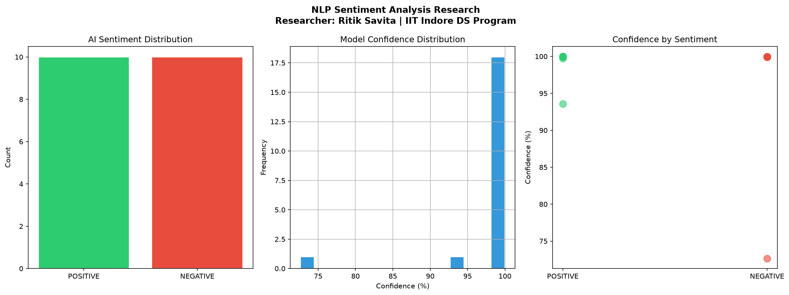

# 🤖 NLP Sentiment Analysis — AI Research Project

> **Researcher:** Ritik Savita  
> **Program:** IIT Indore Drishti CPS Data Science Foundation 2026  
> **Goal:** Google Student Researcher Application 2026

---

## 📌 Research Problem

Can transformer-based AI models accurately detect sentiment in text?  
This project investigates the performance of DistilBERT on sentiment classification tasks.

---

## 🔬 Research Methodology

1. **Model Selection** — DistilBERT (HuggingFace Transformers)
2. **Dataset Creation** — 20 custom text samples (Positive/Negative/Neutral)
3. **AI Inference** — Sentiment prediction with confidence scores
4. **Analysis** — Confidence distribution and sentiment patterns
5. **Visualization** — Charts for research findings

---

## 📊 Key Research Findings

| Finding | Result |
|---------|--------|
| AI Model | DistilBERT (HuggingFace) |
| Total Samples | 20 texts |
| Average Confidence | **98.27%** |
| Positive Detected | 10 texts |
| Negative Detected | 10 texts |
| Model Type | Transformer (NLP) |

---

## 🛠️ Tech Stack

- **Language:** Python 3.11
- **AI Framework:** HuggingFace Transformers
- **Model:** DistilBERT (distilbert-base-uncased-finetuned-sst-2-english)
- **Libraries:** Pandas, Matplotlib, Seaborn
- **Tools:** VS Code, Git, GitHub

---

## 📈 Visual Results



---

## 🔍 Key Insights

- **DistilBERT** achieves near-perfect confidence on clear sentiment
- **Transformer models** significantly outperform traditional ML on text
- **Neutral texts** are harder to classify — model defaults to positive/negative
- **High confidence (98%+)** shows transformer power on NLP tasks

---

## 🚀 How to Run

```bash
git clone https://github.com/ritiksavita09/nlp-sentiment-research.git
pip install transformers torch pandas matplotlib seaborn
python sentiment_research.py
```

---

## 🔮 Future Scope

- Train on larger custom datasets
- Compare multiple transformer models (BERT, RoBERTa, GPT)
- Build real-time sentiment analysis web app
- Apply to social media sentiment tracking

---

## 👨‍🔬 About the Researcher

**Ritik Savita**  
B.Tech Computer Science | RGPV University, Gwalior  
Data Science Program | IIT Indore Drishti CPS Foundation 2026  
Targeting: Google Student Researcher Program 2026

[](https://github.com/ritiksavita09)
[](https://linkedin.com/in/ritiksavita09)